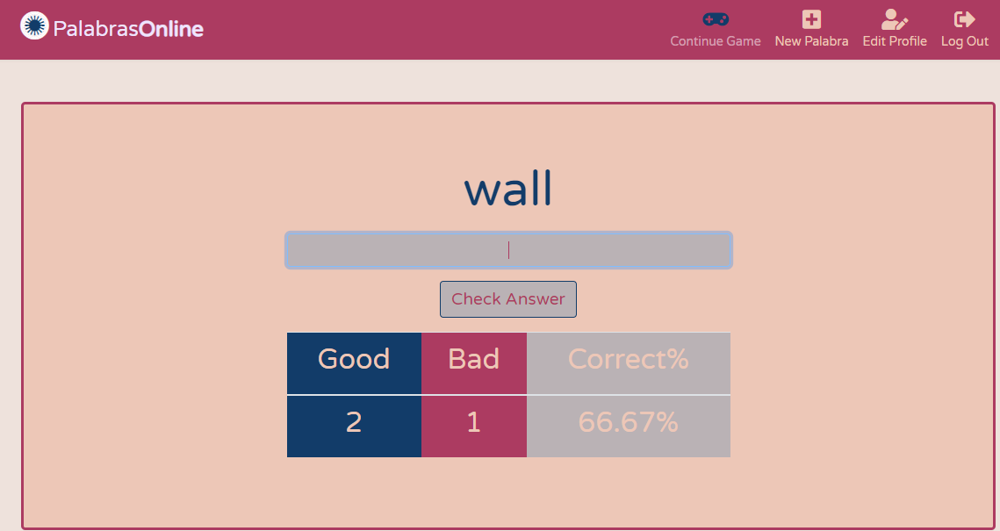
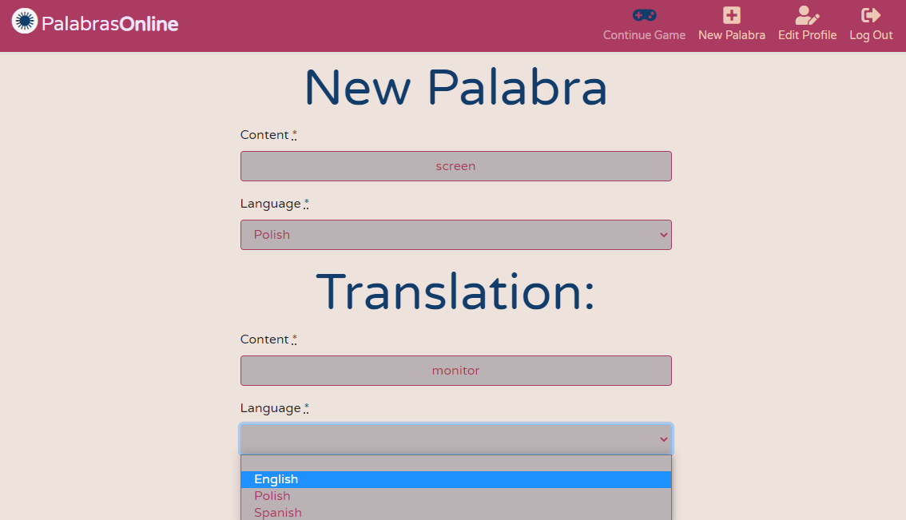
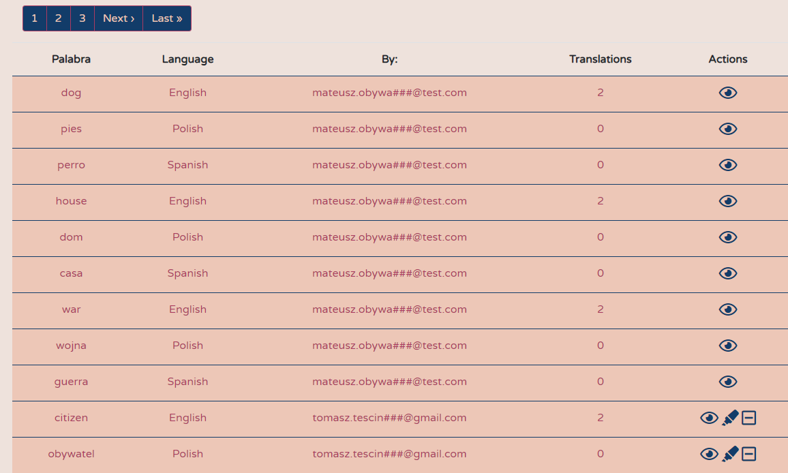

## Palabra app - learn words and translation in different languages.

---

---

## Stack

*  as language.
*  as framework.
*  as database.
*  for continuous-deployment in production (with always forced SSL connection)
*  for continuous-integration
*  as CSS framework.
*  for Front-End styling.
*  for scripts, nested forms and styling.
*  for version control, in this project I have learned branching, pull requests and merging. 
*  for styling and scripts as I moved from Rails asset pipeline.
* **RSpec, FactoryBot, Shoulda-Matchers, Guard-RSpec** as test suite stack.
* gem **language_list** for external Language API list used in database.
* gem **devise** for authentication.
* gem **pundit** for authorization.
* gem **rubocop** for static-code-analysis
* gem **brakeman** for security vulnerability checks.
* gem **bundler-audit** for Bundler security verification
* gem **kaminari** for pagination.
* gem **bullet** in development for killing n+1 queries.
* gem **pry** for debugging.
* Rails debbuger in development.
* gem **faker** for seed sample data.
* gem **nested_forms** for nested Javascript forms.
* gem **simple_form** for clean forms.
* Google Fonts
* **Font-Awesome** as an icon toolkit.
* responsive layout meta tag for mobiles.
* HTML5 shim for pre-9 Internet Explorer browsers.

---

## Configuration & dependencies

### System dependencies

`Ruby: 2.7.2p137`

`Rails: 6.0.3.4`

`database: postgresql`

### Configuration

`git clone https://github.com/tmtocb/palabra-translator-TDD`

`bundle install`

### Database

`rails db:drop db:create db:migrate`

`rails db:seed` to seed database with faker data

### Run the app

`rails s`

`foreman start`

### Development tools

`binding.pry` to debug

`rubocop` for static-code-analysis

`brakeman` for security vulnerability checks.

`bundler-audit` for Bundler security verification

via browser with Rails debugger 

### Run tests

`rspec` to run full test suite

`guard` for autotests live in development